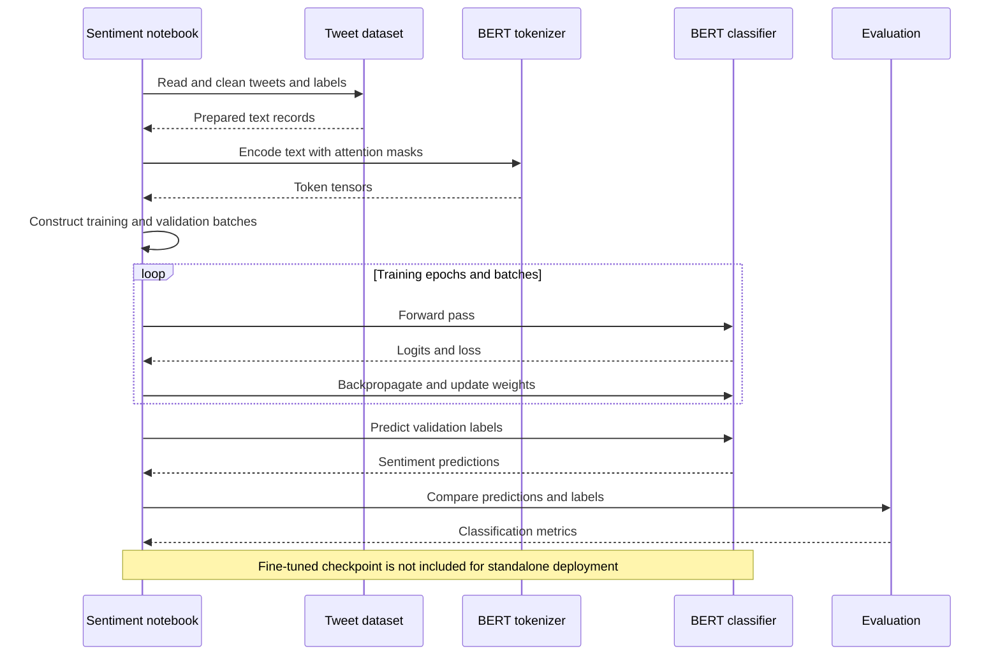

# Twitter Sentiment Analysis

A text analytics and BERT fine-tuning notebook for three-class sentiment classification, with Streamlit and Gradio deployment examples embedded in notebook cells.

**Technology:** Python · PyTorch · Hugging Face Transformers · pandas · NLTK

## Features

- Explore and clean tweet text and sentiment labels.
- Tokenize data and fine-tune a BERT sequence classifier.
- Inspect classification metrics and confusion matrices.
- Experiment with interactive inference through notebook-based Streamlit and Gradio examples.

## Repository guide

| Path | Purpose |
|---|---|
| [Twitter_Sentiment_Analysis.ipynb](Twitter_Sentiment_Analysis.ipynb) | EDA, preprocessing, training, evaluation, and interface examples. |
| [train.csv](train.csv) | Committed text dataset. |
| [Sentiment Analysis Documentation.pdf](Sentiment%20Analysis%20Documentation.pdf) | Project documentation. |
| [Twitter-Sentiment-Analysis.pptx](Twitter-Sentiment-Analysis.pptx) | Presentation material. |

## Requirements and current limitations

Run on a machine with sufficient memory for BERT training; a compatible GPU can accelerate the experiments. Internet access is required for initial pretrained model/tokenizer downloads and any missing NLTK resources.

The checkout does not include a standalone `app.py` or a complete exported BERT checkpoint directory. Save and point the interface cells to a matching fine-tuned checkpoint before using them. Treat public sharing/tunneling cells as optional and review them before execution.

## UML diagrams

### Main workflow

The notebook tokenizes tweet data for BERT training, evaluates predictions, and experiments with a Gradio interface. A ready-to-load fine-tuned checkpoint is not committed.



## Getting started

```bash
git clone https://github.com/IbrahimAbdelsattar/twitter-sentiment-analysis.git
cd twitter-sentiment-analysis
```

Use a Python virtual environment:

```bash
python -m venv .venv
```

Activate it with `source .venv/bin/activate` on macOS/Linux or `.venv\Scripts\Activate.ps1` in PowerShell.

```bash
python -m pip install jupyter pandas numpy matplotlib seaborn plotly nltk palettable scikit-learn scipy torch transformers tqdm streamlit gradio
python -m jupyter notebook
```

Open the notebook listed above and run its cells in order. Adjust dataset and model paths as described in the limitations section.
